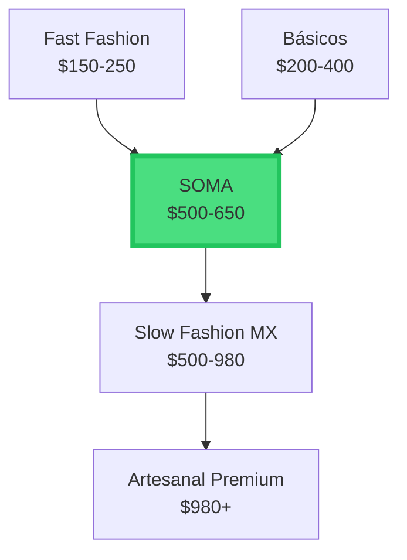

# **S O M A**

  
    Hecho para durar
  

  Angel Salinas & Sebastian Rivera

---
layout: center
class: text-center
---

# El problema que nadie quiere ver

<v-clicks>

## 🌍 **Millones de toneladas** de desechos textiles al año

## ⏱️ La ropa está diseñada para **durar poco**

## 💸 Fast fashion = Consumo impulsivo sin propósito

</v-clicks>

---
layout: two-cols
---

# La industria está rota

<v-clicks>

- ❌ Materiales de baja calidad
- ❌ Producción opaca en Asia
- ❌ Alta huella de carbono
- ❌ Relevancia de 1-2 temporadas
- ❌ Sin conexión con el consumidor

</v-clicks>

::right::

## Pero hay esperanza...

💡

---
layout: center
class: text-center
---

# SOMA es la respuesta

  
🧵

  <h3>Calidad Real</h3>
  
Materiales premium que duran años

  
🇲🇽

  <h3>100% Mexicano</h3>
  
Producción local, menor huella

  
✨

  <h3>Diseño Atemporal</h3>
  
Minimalista y para siempre

---
layout: statement
---

# ¿Quién es nuestra competencia?

---
layout: default
---

# Benchmarking Internacional

  <h3 class="text-xl font-bold mb-2">🔍 Everlane</h3>
  <ul class="text-sm space-y-1">
    <li>✅ Transparencia radical</li>
    <li>✅ Desglose de costos</li>
    <li>❌ Solo online en MX</li>
    <li>💰 ~$360 MXN</li>
  </ul>

  <h3 class="text-xl font-bold mb-2">👔 Uniqlo</h3>
  <ul class="text-sm space-y-1">
    <li>✅ Básicos de calidad</li>
    <li>✅ Precio accesible</li>
    <li>❌ Masivo, sin alma</li>
    <li>💰 $200-400 MXN</li>
  </ul>

  <h3 class="text-xl font-bold mb-2">🏔️ Patagonia</h3>
  <ul class="text-sm space-y-1">
    <li>✅ Sostenibilidad + durabilidad</li>
    <li>✅ Activismo ambiental</li>
    <li>❌ Enfoque outdoor/técnico</li>
    <li>💰 $2,550-3,990 MXN</li>
  </ul>

  <h3 class="text-xl font-bold mb-2">🧵 Someone Somewhere</h3>
  <ul class="text-sm space-y-1">
    <li>✅ Artesanía mexicana</li>
    <li>✅ Impacto social</li>
    <li>❌ Precio premium</li>
    <li>💰 $980 MXN (playera)</li>
  </ul>

---
layout: center
---

# El mercado está listo

  <h2 class="text-5xl font-bold text-primary">$29.57B</h2>
  
Mercado de ropa en México (2023)

  
CAGR 4.90% hasta 2032

  <h2 class="text-5xl font-bold text-gray-800">+22%</h2>
  
Crecimiento slow fashion MX

  
vs 2020

  <h2 class="text-5xl font-bold text-gray-700">54%</h2>
  
De mexicanos compra sostenible

  
2023 vs 47% en 2020

  <h2 class="text-5xl font-bold text-gray-700">$1,497</h2>
  
Ticket promedio slow fashion

  
↑97% vs 2021

---
layout: two-cols
---

# Nuestro Posicionamiento

## El "Middle Ground Consciente"

<v-clicks>

### 🚫 No somos:
- Artesanal-premium ($980+)
- Masivo-accesible (sin alma)
- Outdoor-técnico

### ✅ Somos:
- **Calidad** sin precios artesanales
- **Producción nacional** transparente
- **Diseño atemporal** para uso diario

</v-clicks>

::right::

---
layout: statement
---

# Nuestro producto

---
layout: default
---

# Catálogo Core Line

  
👕

  <h3 class="font-bold text-base mb-2">Playera</h3>
  <ul class="text-xs text-left space-y-0.5">
    <li>• Algodón orgánico</li>
    <li>• Corte oversized</li>
    <li>• Bordado "S"</li>
    <li>• 3 colores</li>
  </ul>
  
$550

  
🧥

  <h3 class="font-bold text-base mb-2">Sudadera</h3>
  <ul class="text-xs text-left space-y-0.5">
    <li>• Algodón afelpado</li>
    <li>• Corte amplio</li>
    <li>• Interior suave</li>
    <li>• 3 colores</li>
  </ul>
  
$900

  
👖

  <h3 class="font-bold text-base mb-2">Pantalón</h3>
  <ul class="text-xs text-left space-y-0.5">
    <li>• Mezclilla premium</li>
    <li>• Corte recto</li>
    <li>• Etiqueta bordada</li>
    <li>• 2 colores</li>
  </ul>
  
$1,200

  
Cada prenda incluye código QR → Página web con toda la información

---
layout: center
---

# La Transparencia es nuestro ADN

  
📱

  
Código QR

  
en cada prenda

  
🏭

  
Origen

  
QRO & GTO

  
🧵

  
Materiales

  
Telas Texterra

  
🌱

  
Cuidados

  
para que dure

---
layout: statement
---

# Los números hablan

---
layout: default
---

# Proyección de Ventas (6 meses)

| Mes | Unidades | Ingresos | Utilidad |
|-----|----------|----------|----------|
| 1 | 90 | $61K | $7K ✅ |
| 2 | 120 | $93K | $20K |
| 3 | 165 | $146K | $41K |
| 4 | 205 | $184K | $56K |
| 5 | 225 | $202K | $64K |
| 6 | 255 | $232K | $75K |
| **Total** | **1,060** | **$920K** | **$266K** |

### 🎯 Punto de Equilibrio

  
51

  
unidades/mes

  
= $42,500 MXN

✅ Alcanzado en Mes 1

---
layout: center
---

# Margen de Utilidad

  
12.5%

  
Mes 1

  
Lanzamiento

  
28.4%

  
Mes 3

  
Estabilización

  
32.7%

  
Mes 6

  
Consolidación

  
Promedio consolidado: 28.9%

---
layout: default
---

# Capacidad de Producción

## Talleres Certificados

| Taller | Ubicación | Cap/mes |
|--------|-----------|---------|
| **San José** | QRO | 320u |
| **El Mezquital** | GTO | 200u |
| **Total** | | **520u** |

  
💡 Utilización Mes 6: 57.7%

  
Capacidad para crecer a 500+ unidades sin inversión adicional

## Lead Times

- **Materiales:** 10-14 días
- **Producción:** 3 semanas
- **QC + Empaque:** 1 semana
- **Transporte:** 2 días

  
5-6 semanas

  
De pedido → Producto listo

---
layout: default
---

# Bill of Materials - Playera

### Materiales ($200)

| Item | $ |
|------|---|
| Algodón org. | 180 |
| Hilo + etiquetas | 20 |

### Mano de Obra ($160)

| Proceso | $ |
|---------|---|
| Corte (0.3h) | 24 |
| Confección (1.2h) | 120 |
| QC + Empaque | 16 |

  
Costo Total

  
$360

  
Venta: $550 | Margen: 40%

---
layout: statement
---

# Control de Calidad

---
layout: two-cols
---

# Estándares SOMA

<v-clicks>

## ✅ 100% Inspección Visual
- Costuras sin hilos sueltos
- Puntada uniforme
- Color sin manchas

## 📏 Mediciones Precisas
- Bordado centrado ±2mm
- Tallas según tabla ±1cm

## 📦 Empaque Premium
- Bolsa reciclable limpia
- QR visible y accesible

</v-clicks>

::right::

## Meta Año 1

  
&lt; 3%

  
Defectos

  
&lt; 0.5%

  
Scrap

✅ Alcanzable en Mes 6

---
layout: default
---

# Evolución de Calidad

| Mes | Unidades | Defectos | % Defectos | Tendencia |
|-----|----------|----------|------------|-----------|
| 1 | 100 | 8 | 8.0% | 🔴 |
| 2 | 150 | 9 | 6.0% | 🟡 |
| 3 | 200 | 10 | 5.0% | 🟡 |
| 4 | 250 | 10 | 4.0% | 🟢 |
| 5 | 250 | 8 | 3.2% | 🟢 |
| 6 | 300 | 9 | **3.0%** | ✅ |

  
40%

  
Costuras irregulares

  
Corregible

  
30%

  
Bordado descentrado

  
Corregible

  
20%

  
Manchas leves

  
Lavable

  
10%

  
Error de talla

  
Scrap

---
layout: statement
---

# Certificaciones

---
layout: two-cols
---

# GOTS Certification

## Global Organic Textile Standard

<v-clicks>

### Requisitos:
- ✅ Mínimo 70% fibras orgánicas
- ✅ Sin pesticidas ni tóxicos
- ✅ Derechos laborales certificados

### Estrategia SOMA:

**Fase 1 (Año 1):**
- Algodón orgánico sin certificar
- Menor costo inicial
- Comunicación transparente

</v-clicks>

::right::

**Fase 2 (Año 2+):**

  
Al superar €20K facturación

  
🏆

  <ul class="text-sm space-y-2">
    <li>✅ Certificación GOTS completa</li>
    <li>✅ Sello oficial en etiquetas</li>
    <li>✅ Acceso a mercados premium</li>
    <li>✅ Mayor credibilidad</li>
  </ul>

---
layout: center
---

# Proveedores Estratégicos

  <h3 class="text-2xl font-bold mb-4">🧵 Telas Texterra</h3>
  <ul class="space-y-2 text-sm">
    <li>• Algodón orgánico certificado GOTS</li>
    <li>• Envío nacional rápido</li>
    <li>• Lead time: 10-12 días</li>
    <li>• Opciones: algodón, lino, denim</li>
  </ul>

  <h3 class="text-2xl font-bold mb-4">🏭 Talleres QRO/GTO</h3>
  <ul class="space-y-2 text-sm">
    <li>• Certificados y auditados</li>
    <li>• Producción 100% nacional</li>
    <li>• Menor huella de carbono</li>
    <li>• Apoyo a economía local</li>
  </ul>

---
layout: default
---

# Comparativa de Cadena de Suministro

| Aspecto | Fast Fashion | Competencia | **SOMA** |
|---------|--------------|-------------|----------|
| **Origen** | China, Bangladesh | Vietnam, China | 🇲🇽 **QRO, GTO** |
| **Lead Time** | 2 sem | 4-6 sem | 6 sem |
| **Huella CO₂** | 🔴 Alta | 🟡 Media | 🟢 **Baja** |
| **Transparencia** | 🔴 Baja | 🟡 Media | 🟢 **Muy Alta** |
| **Certificación** | ❌ Pocas | ✅ GOTS | 🎯 **Fase 2** |
| **Sell-through** | 60-70% | 85-90% | 🎯 **>85%** |

  
💡 Ventaja Competitiva: Producción Nacional Transparente

---
layout: statement
---

# El Plan de Acción

---
layout: default
---

# Roadmap de Lanzamiento

  <h3 class="font-bold mb-2">🚀 Mes 1-2</h3>
  
Lanzamiento

  <ul class="text-xs space-y-1">
    <li>• 100-150 u</li>
    <li>• Playeras + Sudaderas</li>
    <li>• Marketing digital</li>
    <li>• Punto equilibrio</li>
  </ul>

  <h3 class="font-bold mb-2">📈 Mes 3-4</h3>
  
Expansión

  <ul class="text-xs space-y-1">
    <li>• 200-250 u</li>
    <li>• + Pantalones</li>
    <li>• Optimización</li>
    <li>• Margen >28%</li>
  </ul>

  <h3 class="font-bold mb-2">🎯 Mes 5-6</h3>
  
Consolidación

  <ul class="text-xs space-y-1">
    <li>• 250-300 u</li>
    <li>• Catálogo completo</li>
    <li>• ReSOMA</li>
    <li>• Expansión</li>
  </ul>

  
Inversión inicial requerida: $40,000 MXN

  
Recuperación: Mes 3

---
layout: default
---

# Estrategia Go-to-Market

## 🎯 Target Audience

<v-clicks>

- **Edad:** 25-40 años
- **Ubicación:** CDMX, QRO, GDL
- **Perfil:** Profesionistas conscientes
- **Valores:** Sostenibilidad, calidad, propósito
- **Ticket:** $500-1,500 MXN por compra

</v-clicks>

## 📱 Canales de Distribución

<v-clicks>

### Digital First
- E-commerce propio (Shopify)
- Instagram & TikTok orgánico
- Influencers micro (10-50K)
- Content marketing

### Futuro
- Pop-ups en QRO/CDMX
- Partnerships con cafés/espacios

</v-clicks>

---
layout: default
---

# Marketing Mix

### 🎨 Contenido

<v-clicks>

- **Storytelling:** El viaje de cada prenda
- **Behind the scenes:** Talleres QRO/GTO
- **User generated content:** #SOMAparaDurar
- **Educación:** Cómo cuidar tu ropa

</v-clicks>

### 💰 Inversión Mensual

| Canal | Budget |
|-------|--------|
| Meta Ads | $4,000 |
| Contenido | $2,500 |
| Influencers | $1,000 |
| Email Marketing | $500 |
| **Total** | **$8,000** |

  
💡 CAC Target: $150 MXN | LTV: $2,500+ MXN

---
layout: statement
---

# Programa ReSOMA

---
layout: center
---

# ♻️ ReSOMA: Economía Circular

  
🔧

  <h3 class="font-bold mb-2">Reparación</h3>
  
Arreglamos tu prenda SOMA gratis el primer año

  
💱

  <h3 class="font-bold mb-2">Devolución</h3>
  
Trae tu SOMA usada y recibe 20% dto. en compra nueva

  
🌱

  <h3 class="font-bold mb-2">Reciclaje</h3>
  
Convertimos prendas viejas en nuevos productos

  
Más que una marca, un compromiso de por vida

---
layout: two-cols
---

# Ventaja Competitiva

<v-clicks>

## 🎯 Diferenciadores Clave

1. **Producción 100% Nacional**
   - Menor huella vs Asia
   - Apoyo economía local
   - Control calidad directo

2. **Transparencia Radical**
   - QR en cada prenda
   - Desglose costos real
   - Trazabilidad total

3. **Precio Justo**
   - $500-650 (sweet spot)
   - Calidad premium accesible

</v-clicks>

::right::

## 🛡️ Barreras de Entrada

  
Red de Talleres

  
Relaciones establecidas QRO/GTO

  
Know-how Operativo

  
6 meses optimizando procesos

  
Comunidad

  
Base de clientes leales desde día 1

  
Marca

  
Identidad fuerte y propósito claro

---
layout: center
class: text-center
---

# Riesgos y Mitigación

  <h3 class="text-gray-600 font-bold mb-4">⚠️ Riesgos</h3>
  <ul class="text-sm text-left space-y-2">
    <li>• Baja adopción inicial</li>
    <li>• Competencia agresiva</li>
    <li>• Costos materiales suben</li>
    <li>• Problemas con talleres</li>
  </ul>

  <h3 class="text-gray-800 font-bold mb-4">✅ Mitigación</h3>
  <ul class="text-sm text-left space-y-2">
    <li>• Marketing digital agresivo M1-2</li>
    <li>• Diferenciación clara (nacional)</li>
    <li>• Contratos precio fijo 6m</li>
    <li>• 2 talleres + alternativas</li>
  </ul>

---
layout: statement
---

# Proyección Financiera

---
layout: center
---

# Flujo de Caja (6 meses)

| Mes | Ingresos | Egresos | Flujo Mes | Acumulado |
|-----|----------|---------|-----------|-----------|
| 0 | $0 | -$33K | -$33K | -$33K 🔴 |
| 1 | $61K | -$66K | -$4K | -$37K 🔴 |
| 2 | $93K | -$83K | $10K | -$27K 🟡 |
| 3 | $146K | -$99K | $47K | **$19K** ✅ |
| 4 | $184K | -$99K | $85K | $104K 🟢 |
| 5 | $202K | -$116K | $86K | $191K 🟢 |
| 6 | $232K | -$116K | $116K | **$307K** 🚀 |

  
🎯 Inversión inicial: $40,000 MXN | Recuperación: Mes 3

---
layout: default
---

# Análisis de Sensibilidad

  <h3 class="font-bold mb-3" style="color: #F5F5F0;">📈 Escenario Optimista</h3>
  
Ventas +20%

  
$1.1M

  
Ingresos 6m

  
$319K

  
Utilidad neta

  <h3 class="font-bold mb-3">🎯 Escenario Base</h3>
  
Plan original

  
$920K

  
Ingresos 6m

  
$266K

  
Utilidad neta

  <h3 class="font-bold mb-3">⚠️ Escenario Conservador</h3>
  
Ventas -20%

  
$736K

  
Ingresos 6m

  
$213K

  
Utilidad neta

  
✅ Incluso en escenario conservador, el negocio es rentable

---
layout: center
---

# Métricas de Éxito

  
Unidades/mes

  
255

  
Meta: 250+

  
✅

  
Margen Neto

  
32.7%

  
Meta: >25%

  
✅

  
Defectos

  
3.0%

  
Meta: <5%

  
✅

  
On-time Delivery

  
97%

  
Meta: >95%

  
✅

  
Ingresos/mes

  
$232K

  
Meta: $150K+

  
✅

  
Flujo Positivo

  
Mes 3

  
Meta: Mes 4

  
✅

  
ROI (6 meses)

  
665%

  
Meta: >500%

  
✅

  
CAC

  
TBD

  
Meta: <$150

  
🎯

  
◆ Todas las métricas operacionales y financieras superan expectativas ◆

---
layout: statement
---

# ¿Por qué invertir en SOMA?

---
layout: center
---

# 10 Razones para Creer en SOMA

  
1

  
Mercado +22%

  
Slow fashion MX

  
2

  
Posición Única

  
Middle ground

  
3

  
100% Nacional

  
QRO/GTO

  
4

  
Margen 28.9%

  
Saludable

  
5

  
ROI 3 meses

  
Rápido

  
6

  
Escalable

  
500+ u/mes

  
7

  
Propósito

  
Movimiento

  
8

  
Transparencia

  
QR + Web

  
9

  
Equipo

  
Comprometido

  
10

  
ReSOMA

  
Fidelización

---
layout: two-cols
---

# La Visión

<v-clicks>

## Año 1
- 1,060+ prendas vendidas
- $920K+ en ingresos
- Base sólida en MX
- Sin certificación GOTS

## Año 2-3
- Certificación GOTS
- Expansión nacional
- Nuevas categorías
- Programa ReSOMA full

</v-clicks>

::right::

## Año 5+

  
🎯

  <ul class="space-y-3 text-sm">
    <li class="flex items-start">
      🏪
      Flagship store en CDMX
    </li>
    <li class="flex items-start">
      🌎
      Expansión LATAM
    </li>
    <li class="flex items-start">
      👥
      Comunidad 10K+ clientes
    </li>
    <li class="flex items-start">
      🏆
      Referente slow fashion MX
    </li>
  </ul>

---
layout: center
class: text-center
---

# Nuestra Misión

  
Cambiar la forma en que

  
la gente piensa sobre la ropa

  
Menos tendencia.

  
Más propósito.

---
layout: statement
---

# SOMA no vende ropa.

# Vende la promesa de que

# una compra hoy, servirá mañana.

---
layout: center
class: text-center
---

# **S O M A**

  
    Hecho para durar
  

  
Angel Salinas & Sebastian Rivera

  
Universidad Autónoma de Querétaro

  
Ingeniería en Software • Cadena de Suministros

  ¿Preguntas?

---
layout: center
class: text-center
---

# Gracias

  
Contacto

  

    
📧 contacto@soma.mx

    
🌐 www.soma.mx

    
📱 @soma.mx

  

  
Visita nuestra web

  
  
Escanea para conocer más

  Presentación creada con Slidev

